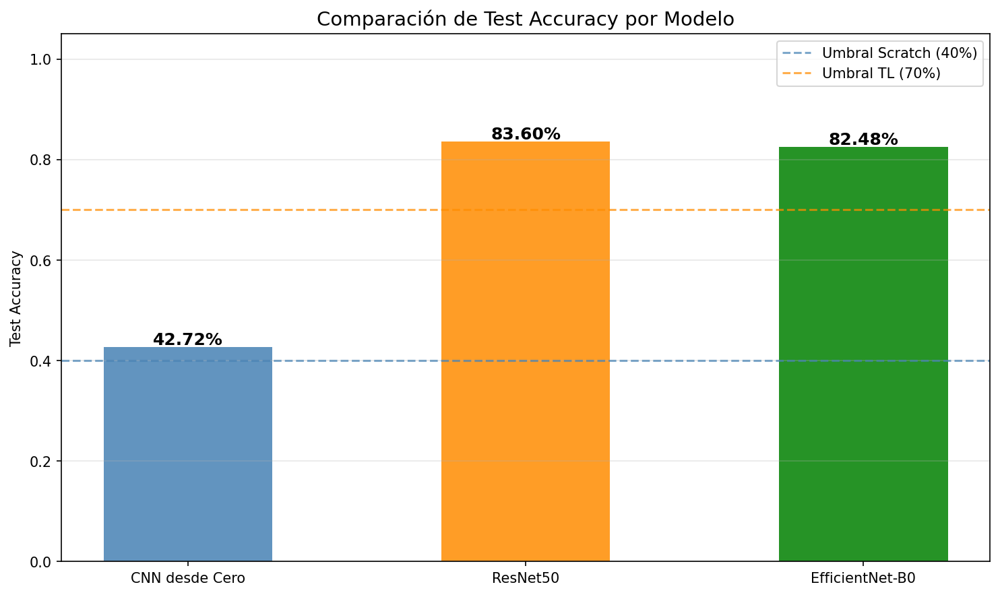

# Clasificador de Landmarks — Transfer Learning

**Proyecto 1 · Modulo 6 Deep Learning · UCB — Msc. Ciencia de Datos e IA Aplicada**

Clasificacion de 50 landmarks mundiales usando Transfer Learning con PyTorch.
Se comparan tres enfoques: CNN desde cero, ResNet50 y EfficientNet-B0.

---

## Resultados

| Modelo | Test Accuracy | Parametros | Objetivo |
|--------|:---:|:---:|:---:|
| CNN desde Cero | 42.72% | ~28M | 40% ✅ |
| **ResNet50** | **83.60%** | 25M | 70% ✅ |
| EfficientNet-B0 | 82.48% | 5.3M | 70% ✅ |



---

## Estructura del Proyecto

```
landmark_images/
├── transfer_learning.ipynb      # Notebook principal (Transfer Learning)
├── cnn_from_scratch.ipynb       # Notebook CNN desde cero
├── run_inference.py             # Script de inferencia standalone
├── execute_cells.py             # Script para ejecutar celdas sin reentrenar
├── Proyecto_Final_*.pdf         # Especificacion del proyecto
├── models/
│   ├── resnet50_scripted.pt         # ResNet50 TorchScript (inferencia)
│   ├── resnet50_best.pt             # ResNet50 pesos entrenados
│   ├── efficientnet_b0_scripted.pt  # EfficientNet TorchScript (inferencia)
│   ├── efficientnet_b0_best.pt      # EfficientNet pesos entrenados
│   ├── cnn_scratch_scripted.pt      # CNN Scratch TorchScript
│   ├── cnn_scratch_best.pt          # CNN Scratch pesos entrenados
│   └── *.png                        # Graficas de entrenamiento y comparacion
├── train/                       # Dataset de entrenamiento (50 clases, ~100 imgs/clase)
├── test/                        # Dataset de evaluacion (50 clases, ~25 imgs/clase)
└── test_images/                 # Imagenes propias para probar el modelo
```

---

## Requisitos

```bash
pip install torch torchvision torchaudio --index-url https://download.pytorch.org/whl/cu130
pip install numpy matplotlib seaborn tqdm livelossplot scikit-learn pillow
pip install jupyter nbclient nbformat
```

> Probado con Python 3.12 · PyTorch 2.11 · CUDA 13.0 · RTX 5060 Ti

---

## Uso Rapido — Inferencia con Imagenes Propias

### Opcion 1: Script Python (sin abrir Jupyter)

```bash
cd landmark_images/
python run_inference.py
```

Coloca tus imagenes en `test_images/` antes de ejecutar.
Los resultados se guardan como PNG comparativos en `test_images/resultados/`.

### Opcion 2: Funcion `predict_landmarks` en Python

```python
import os, torch
import torchvision.transforms as T
from PIL import Image

# Cargar modelo
device = torch.device("cuda" if torch.cuda.is_available() else "cpu")
model  = torch.jit.load("models/resnet50_scripted.pt", map_location=device)
model.eval()

# Preprocesamiento identico al entrenamiento
transform = T.Compose([
    T.Resize(256), T.CenterCrop(224), T.ToTensor(),
    T.Normalize([0.485, 0.456, 0.406], [0.229, 0.224, 0.225])
])

class_names = sorted(os.listdir("train"))

def predict(img_path, k=5):
    img    = Image.open(img_path).convert("RGB")
    tensor = transform(img).unsqueeze(0).to(device)
    with torch.no_grad():
        probs = torch.softmax(model(tensor), dim=1)
        top_k = torch.topk(probs, k)
    return [(class_names[i], round(p.item(), 4))
            for i, p in zip(top_k.indices[0], top_k.values[0])]

# Ejemplo
print(predict("test_images/marmuerto.jpg", k=3))
# => [('03.Dead_Sea', 0.9864), ...]
```

---

## Correr el Notebook sin Reentrenar

Los modelos ya estan entrenados. Para probar inferencia desde Jupyter:

### Paso 1 — Abrir Jupyter

```bash
cd landmark_images/
jupyter notebook transfer_learning.ipynb
```

### Paso 2 — Ejecutar SOLO estas celdas (en orden)

| Indice | Descripcion |
|--------|-------------|
| `idx=1` | Importaciones (torch, PIL, numpy, etc.) |
| `idx=2` | Device (GPU/CPU), rutas, semillas |
| `idx=4` | Transformaciones (`eval_transform`) |
| `idx=22` | Carga modelos TorchScript + define `predict_landmarks` |
| `idx=29` | Pipeline standalone (carga ambos modelos, reconstruye clases) |
| `idx=30` | Demo: predice sobre imagenes en `test_images/` |

> **No ejecutes** los indices 9-17 (entrenamiento). Tardan 2-4 horas y requieren GPU.

### Paso 3 — Agregar tus imagenes

Coloca archivos `.jpg` o `.png` en `test_images/` y ejecuta la celda `idx=30`.

---

## Reentrenar desde Cero (opcional)

```bash
jupyter notebook transfer_learning.ipynb
# Kernel > Restart & Run All
# Tiempo estimado: ~2-4 horas con GPU (RTX 3060 o superior)
```

Configuracion:
- **Epocas**: 20 (feature extraction) + 20 (fine-tuning) por modelo
- **Optimizador**: Adam con `ReduceLROnPlateau` (factor=0.1, patience=5)
- **Batch size**: 64
- **Augmentation**: RandAugment + ColorJitter + RandomHorizontalFlip

---

## Arquitectura — Estrategia 2 Fases

```
Backbone preentrenado en ImageNet
        |
   [Congelar backbone]
        |
   Nueva cabeza lineal (50 clases)
        |
  Fase 1: Entrenar solo cabeza (20 epocas, lr=1e-3)
        |
  Fase 2: Fine-tuning completo  (20 epocas, lr=1e-5)
        |
  Mejor modelo guardado en models/*.pt  (criterio: val_loss)
```

- **ResNet50**: 25M parametros, residual connections, ImageNet1K_V1
- **EfficientNet-B0**: 5.3M parametros, compound scaling — mejor eficiencia por parametro

---

## Dataset

Subconjunto del [Google Landmarks Dataset v2](https://github.com/cvdfoundation/google-landmark):

- **50 clases** de landmarks mundiales
- **~100 imagenes/clase** para entrenamiento
- **~25 imagenes/clase** para evaluacion
- Division train/validation: 80% / 20% (aleatoria con semilla 42)

Landmarks incluidos: `Haleakala National Park`, `Ljubljana Castle`, `Dead Sea`,
`Machu Picchu`, `Eiffel Tower`, `Great Wall of China`, `Trevi Fountain`, y 43 mas.

---

## Archivos de Modelo

| Archivo | Tamano | Proposito |
|---------|--------|-----------|
| `models/resnet50_scripted.pt` | 91 MB | Inferencia ResNet50 (recomendado) |
| `models/efficientnet_b0_scripted.pt` | 17 MB | Inferencia EfficientNet-B0 |
| `models/cnn_scratch_scripted.pt` | 100 MB | Inferencia CNN desde cero |
| `models/resnet50_best.pt` | 91 MB | Pesos para continuar entrenamiento |
| `models/efficientnet_b0_best.pt` | 16 MB | Pesos para continuar entrenamiento |
| `models/cnn_scratch_best.pt` | 100 MB | Pesos para continuar entrenamiento |

> Los archivos `*_scripted.pt` son modelos TorchScript listos para inferencia sin depender del codigo de entrenamiento.

---

## Presentacion en Video

Puedes ver la presentacion y explicacion del proyecto en el siguiente enlace:

**[Ver presentacion en YouTube](https://www.youtube.com/watch?v=-YL226J_e9U)**

---
## Visualizacion del Repositorio

[](https://repobeats.axiom.co)

---

*Simon Alex Rodriguez · UCB · 2025*
